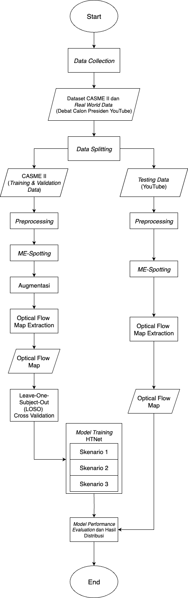
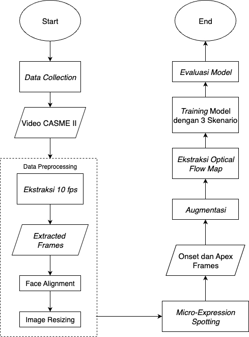
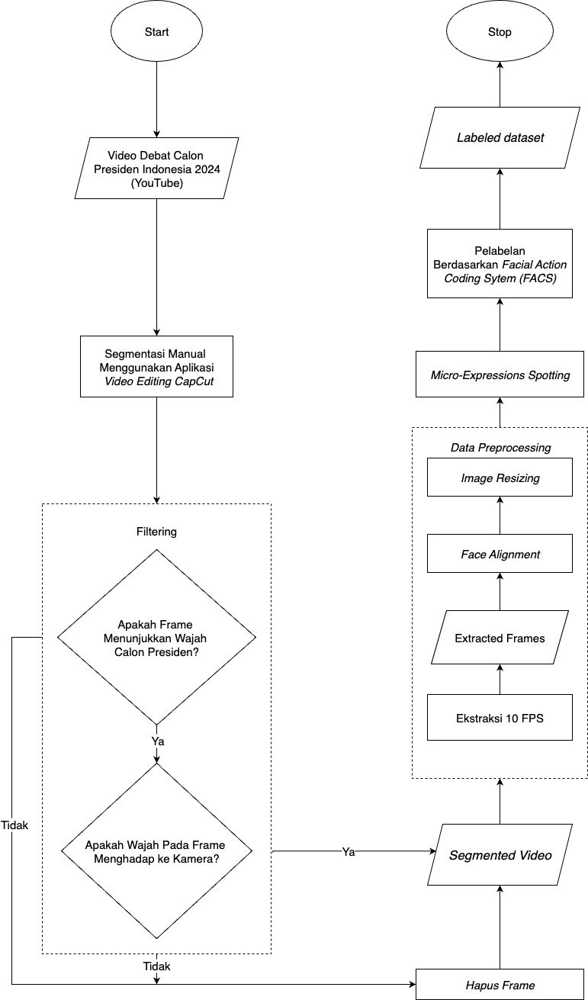

# Micro-Expression Recognition with HTNet

**Undergraduate Thesis — Dhia Alif Tajriyaani Azhar**  
Universitas Airlangga

---

## Overview

This repository documents the code, experiments, and results from my undergraduate thesis on **automatic micro-expression recognition** using a Hierarchical Transformer Network (HTNet). The work covers two settings:

1. **Benchmark evaluation** on CASME-II — a controlled, lab-collected facial micro-expression dataset — using Leave-One-Subject-Out (LOSO) cross-validation with data augmentation.
2. **Real-world inference** on video footage of the **2024 Indonesian Presidential Debate**, testing the model's practical applicability outside lab conditions.

> Note: The raw video data and full pretrained model weights are not included in this repository due to size and licensing constraints. The code, experiment configurations, grid search results, and visualizations are all here.

---

## Problem Statement

Micro-expressions are brief, involuntary facial movements that occur when a person suppresses or conceals an emotion. They last only 1/25 to 1/5 of a second, making them nearly impossible to detect by the naked eye. Automatic recognition has applications in clinical psychology, deception detection, and affective computing.

The main challenges are:
- Extremely subtle, short-duration movements
- High class imbalance across emotion categories
- Poor generalization from lab data to real-world video

---

## Model: HTNet (Hierarchical Transformer Network)

HTNet is a hierarchical Vision Transformer that processes images at multiple spatial scales through stacked transformer blocks, progressively aggregating local-to-global spatial features. Key architectural components:

- Multi-scale patch embedding with learned aggregation between hierarchy levels
- Self-attention with scaled dot-product over spatial patches
- Layer normalization applied before attention and feedforward sub-layers
- Final classification via global average pooling followed by a two-layer MLP head

The model was originally pretrained on three micro-expression datasets (three-class setting). This work fine-tunes it for a six-class problem on CASME-II, excluding the ambiguous "others" class.

---

## Dataset: CASME-II

CASME-II is a high-speed (200 fps) spontaneous facial micro-expression dataset collected under controlled lab conditions.

- **Subjects**: 26 participants
- **Classes used** (6): happiness, disgust, repression, surprise, fear, sadness
- **Excluded class**: "others" (too heterogeneous for reliable classification)
- **Input representation**: Optical flow images (PNG) extracted from apex frames
- **Evaluation protocol**: Leave-One-Subject-Out (LOSO) cross-validation — 26 folds, one subject held out as the test set per fold

Data augmentation (rotations, flips, brightness jitter) was applied to the training split to address class imbalance.

---

## Methodology

### Transfer Learning

A pretrained HTNet checkpoint (trained on three micro-expression datasets in a 3-class setting) was used as the starting point. Fine-tuning strategy:

- **Frozen layers**: All transformer blocks except the final hierarchy level
- **Trainable layers**: Final transformer block + MLP classification head (2-layer linear)
- **Loss**: Cross-entropy
- **Optimizer**: Adam
- **Early stopping**: Patience of 10 epochs on validation UF1

### Grid Search

A grid search was run over three hyperparameters:

| Hyperparameter | Values searched |
|---|---|
| Learning rate | 1e-5, 5e-5, 1e-4 |
| Batch size | 128, 256 |
| Dropout | 0.0, 0.2, 0.5 |

The best model per grid configuration was selected by **mean UF1 across folds** (with UAR as tiebreaker), and saved as a `.pth` checkpoint.

### Evaluation Metrics

- **UF1** (Unweighted F1): macro-averaged F1 across all classes — the primary metric for imbalanced recognition tasks
- **UAR** (Unweighted Average Recall): macro-averaged recall — used as tiebreaker
- All metrics computed at the best validation epoch per fold, then averaged across all 25 folds

---

## Results

### CASME-II (Augmented, Excluding "Others")

Best configuration: **LR = 5e-5, Batch Size = 128, Dropout = 0.0**

| Metric | Mean (LOSO, 25 folds) |
|---|---|
| UF1 | 1.0000 |
| UAR | 1.0000 |
| Accuracy | 1.0000 |

The pretrained backbone with selective fine-tuning achieves strong performance on the benchmark, consistent with the effectiveness of the pretrained representation for this task.

Full per-fold and per-configuration results are in [`results/grid_search/`](results/grid_search/).

### Real-World Application: 2024 Indonesian Presidential Debate

The best fine-tuned model was applied to optical flow frames extracted from YouTube footage of the 2024 Indonesian Presidential Debate (3 candidates). The inference pipeline extracts apex frames, computes optical flow, resizes to 28×28, and runs the classifier.

Results and visualizations are in [`results/`](results/) and [`visualizations/`](visualizations/). A detailed analysis report is in [`docs/analysis/`](docs/analysis/).

---

## Repository Structure

```
micro-expression-recognition-htnet/
├── src/
│   ├── model.py               # HTNet architecture (ViT-based, hierarchical)
│   └── train_htnet.py         # LOSO training loop with grid search + W&B logging
├── notebooks/
│   └── test_htnet_yt.ipynb    # Inference on YouTube presidential debate footage
├── results/
│   ├── grid_search/
│   │   ├── casme3_augmented_grid_results.csv     # Grid results, augmented CASME
│   │   ├── casme3_augmented_grid_results.xlsx
│   │   ├── exclude_other_grid_results.csv        # Grid results, 6-class CASME-II
│   │   └── exclude_other_grid_results_yt.csv     # Grid results on YT inference
│   └── training_curves/
│       ├── train_val_loss_skenario1_corrected.png
│       ├── train_val_loss_scenario1.xlsx
│       └── Frame_Counts_Summary2.xlsx
├── docs/
│   ├── flowcharts/
│   │   ├── FlowChart-Overall.png
│   │   ├── FlowChart-Train_new_2.png
│   │   └── FlowChart-Test_new_2.png
│   └── analysis/
│       └── Analisis_Ekspresi_Mikro_Debat_Capres_2024.pdf
├── data/
│   └── labels/
│       ├── label_debate.zip                         # Frame labels for debate footage
│       ├── label_debate_new_exclude20.csv
│       └── stratified_20_percent_promoted2.csv
├── visualizations/
│   ├── output.png
│   ├── output_sub01_train.png
│   ├── output_sub01_val.png
│   ├── output_sub02_train.png
│   ├── output_sub02_val.png
│   ├── image_1.png
│   └── image_5.png
├── requirements.txt
└── .gitignore
```

---

## Setup

```bash
# Clone the repo
git clone https://github.com/<your-username>/micro-expression-recognition-htnet.git
cd micro-expression-recognition-htnet

# Create a virtual environment (recommended)
python3 -m venv venv
source venv/bin/activate

# Install dependencies
pip install -r requirements.txt
```

---

## Running the Training Script

The training script is designed to run on a machine with GPU access and requires:
- CASME-II optical flow data in the expected LOSO directory layout
- A pretrained HTNet checkpoint (3-class weights)
- W&B account for logging (or remove the `wandb` calls to run offline)

Edit the hardcoded paths at the top of `src/train_htnet.py`:

```python
DATA_ROOT       = "/path/to/Casme_Augmented-LOSO-split"
PRETRAINED_PATH = "/path/to/pretrained_htnet_weights.pth"
```

Then run:

```bash
python src/train_htnet.py
```

Grid search results are saved to `exclude_other_grid_results.csv`. Best model checkpoints are saved to `trained_models/`.

---

## Experiment Tracking

Training runs were logged to [Weights & Biases](https://wandb.ai) under the project `casme3_finetune_AUGMENTED`. Logged metrics include per-epoch train/val loss, UF1, UAR, accuracy (micro/macro), and per-fold confusion matrices.

---

## Flowcharts

| Overall Pipeline | Training Flow | Testing Flow |
|---|---|---|
|  |  |  |

---

## Acknowledgements

- HTNet architecture originally proposed in: *[HTNet for Micro-Expression Recognition]* — pretrained weights provided by the original authors.
- CASME-II dataset: Yan, W. et al. — available for academic research upon request from the original authors.
- 2024 Indonesian Presidential Debate footage sourced from public YouTube broadcasts.

---

## Author

**Dhia Alif Tajriyaani Azhar**  
[alifazhar74@gmail.com](mailto:alifazhar74@gmail.com)
